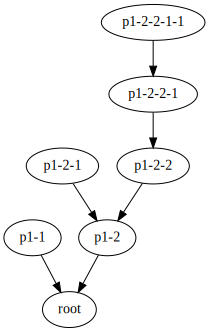

============================
**Data Containers**: Product
============================

.. contents:: Table of Contents
	      :depth: 3

Product
=======

Product is what links all fdi components together.

Data and Meta Data
-------------------

.. image:: ../_static/product.png
   :width: 50%
		   
A product has
   * zero or more datasets: defining well described data entities (say images, tables, spectra etc...). 
   * accompanying meta data -- required information such as

     * the classification of this product,
     * the creator this product,
     * when was the product created?
     * what does the data reflect? (its intended use scope)
     * and so on;
     * possible additional meta data specific to that particular product type.
   * history of this product: how was this data created.
   * References of relevant products that form a context of this product

     
History
-------

Product History records how each step of data processing has manipulated the data. Every pipeline add information of input data, auxliary data, calibration data, command line, environment variables to a :class:'fdi.dataset.history.History' object attached to the product. `History` can walk up the processing-input chain and visualize the hitory of an example product named "root" ::

   "p1-1" [ref="urn:pools0:fdi.dataset.baseproduct.BaseProduct:1"];
   root;
   "p1-2" [ref="urn:pools0:fdi.dataset.product.Product:1"];
   "p1-2-1" [ref="urn:pools0:fdi.pal.context.Context:0"];
   "p1-2-2" [ref="urn:pools0:fdi.pal.context.MapContext:0"];
   "p1-2-2-1" [ref="urn:pools0:fdi.dataset.testproducts.TP:0"];
   "p1-2-2-1-1" [ref="urn:pools0:fdi.dataset.testproducts.SP:0"];
   "p1-1" -> root;
   "p1-2" -> root;
   "p1-2-1" -> "p1-2";
   "p1-2-2" -> "p1-2";
   "p1-2-2-1" -> "p1-2-2";
   "p1-2-2-1-1" -> "p1-2-2-1";

with a Directed Acyclic Graph like this:

Serializable
---------------

In order to transfer data across the network between heterogeneous nodes data needs to be serializable.
JSON format is used considering to transfer serialized data for its wide adoption, availability of tools, ease to use with Python, and simplicity.

Product Definition Methodology
------------------------------

Data Products almost always are classified in heirachical orders, reflecting the underlying relation of the data model. Many Products are found to have inheritance relations when comparing their metadata and datasets. Therefore an object-oriented approach is chosen to anlize and define the structure, function, and interface of Products here.

First specify built-in Parameters  in in YAML format, which is suitable for reading by both humans and machines. A helper utility ``yaml2python``  to generate test-ready Python code of product class module containing the built-ins.

The YAML schema allows a child Product to inherit metadata definition from one or multiple parent Products. Overriding is also allowed.

BaseProduct
"""""""""""

This is the definition file `BaseProduct.yml`

.. include:: ../../../fdi/dataset/resources/BaseProduct.yml
   :code: yaml

The preamble key-value pairs give information about this definition:

:name:  of this product
:description: -- Information about this product
:parents: -- Children products Inherit parent’s metadata
:level: Applicable Level
:schema: version of format of this YAML document

From the creation process requires every product to carry the following metadata entries about itself, 

:description: (Also in native language if it is not English.)
:type: -- In software or business domain
:version: -- Products of the same format must be versioned, configuration controlled, and be ready to deal with version differences between inputs , algorithms, software and pipelines.
:FORMATV: -- Version of this document with Schema information, e.g. 1.4.1.2
:creator, rootCause, creationDate: -- Who, why, when, where

The parameters are tabulated below.

.. include:: ../../../fdi/dataset/resources/BaseProduct.rst

Product Hierachy
----------------

Product Levels
""""""""""""""

Product generation is usually a process with a number of stages. Each stage often produces consumeable prooducts of similar processing "levels". The processing levels adopted here are:

====== =================================================================
Level  Description
====== =================================================================
L0      Data organized in stram of homogeneous packets or transmision frames.
L1A     Structured, key-value pairs and arrays, input is packet or frame stream.
L1B     Formated according to application domain convention. Translate instrument-specific format to physics standard (e.g. hardware time to Fine Time.) No information from L1A is lost. This is the starting point of most domain-users who demand unspoiled but civilized data.
L1C      Binary switch,  binary masked, and enumerated metadata quantities are translated to text/numerical mnemonics according to metadata value; domain-specific customary coorrdinates, representation or format are used (e.g. R.A. Dec. instead of quaternion; TT instead of TAI). Some information from L1B is lost.
====== =================================================================

Quick-look, or "browse" product can be generated for data products at any level. Their generation is not mandatory.

Although product levels defined this way is useful for grouping, they are too coarse and general for specifying relations between specific products or product groups with respect to other ones preciely. To do that a rigorous hierachical approach is needed.

Examples (from :doc:`quickstart` page):

.. include:: quickstart.rst
   :start-after: Product with metadata and datasets
   :end-before: pal - Product Access Layer

