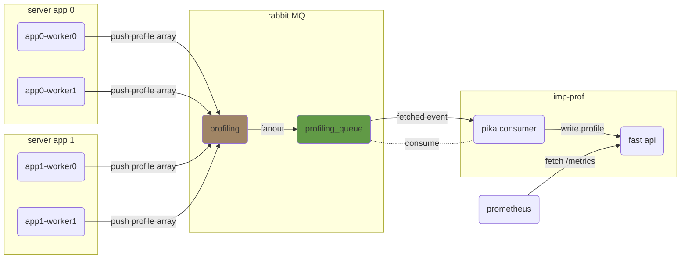

# imp-prof

Imp-prof serves to collect and publish [prometheus](https://prometheus.io/) metrics from pre-forked uWSGI server workers.

```mermaid
flowchart LR
    A0W0(app0-worker0)
    A0W1(app0-worker1)
    A1W0(app1-worker0)
    A1W1(app1-worker1)
    E(profiling):::exchange
    Q(profiling_queue):::queue
    I(pika consumer)
    F(fast api)
    P(prometheus)
    subgraph source[server app 0]
        A0W0
        A0W1
    end
    subgraph source2[server app 1]
        A1W0
        A1W1
    end
    A0W0-->|push profile array|E
    A0W1-->|push profile array|E
    A1W0-->|push profile array|E
    A1W1-->|push profile array|E
    subgraph rabbit[rabbit MQ]
        E-->|fanout|Q
    end
    subgraph imp[imp-prof]
        I-->|write profile|F
    end
    Q-->|fetched event|I
    Q-.-|consume|I
    P-->|fetch /metrics|F
    classDef exchange fill:#A08565;
    classDef queue fill:#619A46;
```